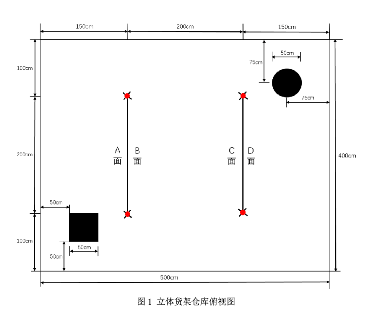
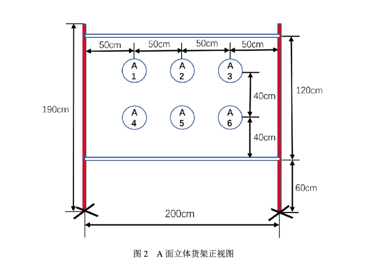

# 立体货架盘点无人机系统（D题）

## 一、任务

设计并制作一款由多旋翼飞行器和带显示器的无线地面站构成的系统，能够实现对立体货架上全部货物的自主巡检、盘点，以及对特定货物的单独盘点；地面站能显示盘点结果信息。

图1为一个大小为 **400 cm × 500 cm** 的仓库俯视图，黑色方形区域为起飞点，黑色圆形区域为降落点，另有 **2 个双面立体货架**。每个货架两端为红色圆杆，立体货架的 4 个面编号为 **A面、B面、C面、D面**，每个面上有 6 个固定坐标位置，用于张贴包含货物编号信息的二维码，共 **24 个二维码**。图2为货架 A 面的正视图。

---

## 二、要求

### （1）完成对立体货架的遍历盘点，地面站实时显示相关盘点结果信息

1. 无人机在起飞点垂直起飞，至 **150 ± 10 cm** 的高度。  
   **（5分）**

2. 无人机自主完成对 2 个货架 4 个面上全部货物的遍历盘点：

   ① 盘点过程中，无人机使用机身上的激光笔指示盘点对象；盘点过程中激光笔关闭，成功收集一个货物信息后，激光笔在被盘点的二维码范围内点亮一次，亮 **0.5 秒左右**。  
   **（24分）**

   ② 盘点过程中，地面站端用不小于 **3.5 吋** 的 LCD 显示屏实时显示盘点结果，即货物编号和位置坐标信息。  
   货物编号为 **1~24** 的数值；坐标信息为 **A1~A6、B1~B6、C1~C6、D1~D6**。  
   无人机每盘点到一个货物，地面站上的 LED 灯亮灭一次，亮 **1 秒左右**。  
   **（12分）**

3. 完成遍历盘点后，无人机稳定降落在降落点，无人机几何中心点不超出降落区域。  
   **（5分）**

4. 盘点结束后，地面站可显示全部盘点结果，并可输入货物编号查询，显示货物坐标信息。  
   **（5分）**

5. 遍历盘点过程用时越少越好。  
   **（10分）**

---

### （2）完成指定货物的定向盘点

1. 无人机上电后，给无人机识别 1 张抽取的二维码，无人机报送识别的货物编号给地面站显示。  
   **（2分）**

2. 地面站 LCD 显示屏上显示规划的定点盘点航线图。  
   **（8分）**

3. 启动无人机在起飞点垂直起飞，按照规划航线飞往目标货物，激光笔在被盘点的二维码范围内点亮一次，亮 **0.5 秒左右**，识别目标货物二维码信息并传回地面站，地面站显示货物编号和坐标信息，地面站上的 LED 灯亮灭一次，亮 **1 秒左右**。  
   **（9分）**

4. 完成定点盘点后，无人机稳定降落在降落点，无人机几何中心点不超出降落区域。  
   **（5分）**

5. 定点盘点过程用时越少越好。  
   **（10分）**

---

### （3）其他

**（5分）**

---

### （4）设计报告

**（20分）**

---

## 三、说明

### （1）立体货架说明

1. 参赛队在赛区提供的场地测试，不得擅自改变测试环境条件。

2. 货架板面采用厚度为 **5 mm** 的硬质白色 PVC 板制作，在板的双面固定位置上随机张贴本题提供的 24 张二维码图像，二维码内容为 **1~24** 的数字值。二维码打印在白色 A4 纸张上，尺寸为 **19 cm × 19 cm 左右**。

3. 货架两端支架采用直径为 **3~4 cm** 的红色圆形杆，颜色为 **R-255、G-0、B-0**，高度不低于 **190 cm**。应考虑到材料及颜料导致存在色差的可能性。  
   2 个圆形杆之间横向固定 2 个硬质白色杆子，货架板上可制作多个孔，用于使用扎带等固定在四周杆体上。

4. **400 cm × 500 cm** 作业区四周及顶部设置安全网，安全网支架安装在安全网外。安全网外测试现场避免阳光直射，但不排除顶部照明灯及窗外环境光照射。参赛队应考虑到测试现场会受到外界光照或室内照明不均等影响因素，测试时不得提出光照条件要求。

---

### （2）无人机系统要求

1. 参赛队使用无人机时应遵守中国民用航空局的相关管理规定。

2. 无人机最大轴间距不大于 **45 cm**。

3. 无人机桨叶必须全防护，否则不予测试。

4. 无人机上的激光笔水平向安装，不得移动、转动；激光笔照射到板面上的光斑直径不得大于 **6 mm**。

5. 无人机辅助定位方式不限。

6. 调试及测试时必须佩戴防护眼镜，穿戴防护手套。

7. 测评起飞前，无人机可手动放置到起飞点，手动一键启动后起飞；起飞后整个盘点过程中不得人为干预，盘点过程无人机不得降落。  
   若采用无人机以外的启动或急停操作装置，一键启动起飞操作后必须立刻将装置交工作人员监管。

8. 要求定点盘点起飞前，将抽取与货架上某一张二维码相同的图片给无人机识别，识别前仅可按键或者点击系统屏幕一次；识别完成后，手动一键启动后起飞。

---

### （3）测试要求与说明

1. 无人机起飞至降落连续完成，期间不得人为干预。

2. 遍历盘点过程必须在 **270 秒内** 完成，超时相关评分模块不得分。

3. 定点盘点过程必须在 **180 秒内** 完成，超时相关评分模块不得分。

4. 每次测试全过程中不得更换电池；两次测试之间允许更换电池，更换电池时间不大于 **2 分钟**。

5. 飞行期间，无人机触及地面后自行恢复飞行的，扣 **5 分**；触地后 **5 秒内** 不能自行恢复飞行视为失败，失败前完成动作仍计分。

6. 平稳降落是指在降落过程中无明显的跌落、弹跳及着地后滑行等情况出现。

---

## 四、评分标准

| 分类     | 项目                 | 主要内容                                               | 满分 |
| :------- | :------------------- | :----------------------------------------------------- | :--- |
| 设计报告 | 方案论证             | 技术路线、系统结构，方案描述、比较与选择               | 3    |
| 设计报告 | 理论分析与计算       | 控制方法描述及参数计算                                 | 5    |
| 设计报告 | 电路与程序设计       | 系统组成，原理框图与各部分电路图，系统软件设计与流程图 | 7    |
| 设计报告 | 测试方案与测试结果   | 测试方案及测试条件，测试结果完整性，测试结果分析       | 3    |
| 设计报告 | 设计报告结构及规范性 | 摘要、报告正文结构、公式、图表的完整性和规范性         | 2    |
| 设计报告 | 合计                 | —                                                      | 20   |
| 要求     | 完成第1项            | —                                                      | 61   |
| 要求     | 完成第2项            | —                                                      | 34   |
| 要求     | 完成第3项            | —                                                      | 5    |
| 要求     | 合计                 | —                                                      | 100  |
| 总分     | —                    | —                                                      | 120  |